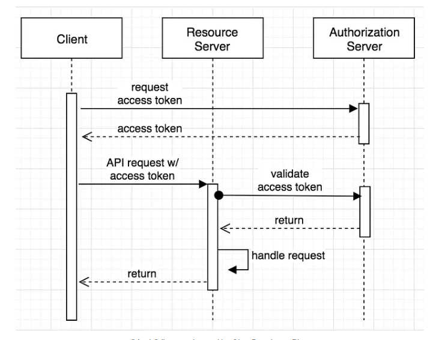

# mindAPI
**This is a statfull api (Using Google Oauth2)**, mindAPI check the signature of tokens provided by google then authorize the acces to the ressource(= resource server)
For obvious security reasons**it is mandatory to communicate with https with this API**
## TODOS : 
1 handle jwt 
2 user crud
3 (if possible) RBAC

